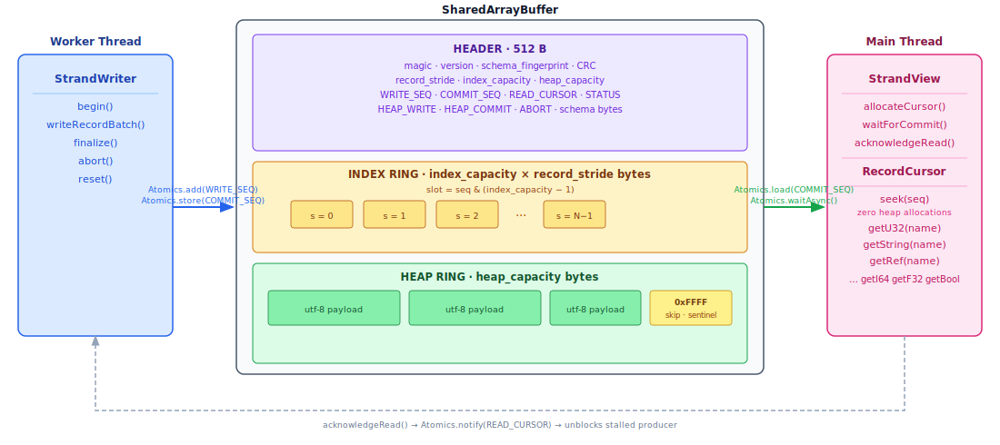

# @strand/core

Zero-copy genomic data streaming over `SharedArrayBuffer`.

A Worker thread writes records into a lock-free ring buffer; the main thread reads them with zero deserialization overhead and zero per-record heap allocation. Built for high-throughput genomic data streaming (VCF, BAM, BED, BigWig).

---

## How it works



**Backpressure** is automatic: if the consumer falls more than `index_capacity` records behind, `writeRecordBatch()` blocks via `Atomics.wait()` until the consumer calls `acknowledgeRead()`.

**Zero allocation**: `RecordCursor.seek(seq)` mutates two fields on a single pre-allocated object. Calling `getString()` decodes UTF-8 from the SAB once per field per record and caches the result — subsequent calls on the same record are free.

---

## Sequence diagram

```
Main thread                        SharedArrayBuffer             Worker thread
     │                                      │                          │
     │  new SharedArrayBuffer(map.total_bytes)                         │
     │  initStrandHeader(sab, map)           │                          │
     │──────────────────────────────────────>│                          │
     │  new StrandView(sab)                  │                          │
     │  allocateCursor()                     │                          │
     │                                       │  new StrandWriter(sab)   │
     │                                       │<─────────────────────────│
     │                                       │  begin()                 │
     │                                       │<─────────────────────────│
     │                                       │                          │
     │  waitForCommit(0) ···waiting···        │  writeRecordBatch([...]) │
     │                                       │<─────────────────────────│
     │                              COMMIT_SEQ += N                     │
     │                              Atomics.notify ──────────────────>  │
     │<── resolves ──────────────────────────│                          │
     │  for seq in 0..N:                     │                          │
     │    cursor.seek(seq)                   │  writeRecordBatch([...]) │
     │    cursor.getU32('pos')               │<─────────────────────────│
     │    cursor.getString('sequence')       │  (blocks if ring full)   │
     │  acknowledgeRead(N) ─────────────────>│ ── wakes writer ──────>  │
     │                                       │                          │
     │  waitForCommit(N) ···waiting···        │  finalize()              │
     │                              STATUS = EOS                        │
     │<── resolves ──────────────────────────│                          │
     │  view.status === 'eos' → done         │                          │
```

---

## Installation

```bash
npm install @strand/core
```

Requires a runtime with `SharedArrayBuffer` and `Atomics`. In browsers, the serving page must be [cross-origin isolated](#browser-requirements).

---

## Quick start

### 1. Define a schema (shared between producer and consumer)

```typescript
import { buildSchema, computeStrandMap, initStrandHeader } from '@strand/core';

const schema = buildSchema([
  { name: 'chrom',    type: 'utf8_ref' }, // interned chromosome name (u32 handle)
  { name: 'pos',      type: 'u32'      }, // 0-based start position
  { name: 'end',      type: 'u32'      }, // exclusive end position
  { name: 'quality',  type: 'f32'      }, // PHRED quality score
  { name: 'sequence', type: 'utf8'     }, // variable-length read sequence
]);

const map = computeStrandMap({
  schema,
  index_capacity:    65_536,      // must be a power of 2; ring slots for records
  heap_capacity:     16 * 1024 * 1024, // bytes for variable-length string data
  query:             { assembly: 'hg38', chrom: 'chr1', start: 0, end: 248_956_422 },
  estimated_records: 50_000,
});

// Create the SAB once on the main thread and pass it to the worker.
const sab = new SharedArrayBuffer(map.total_bytes);
initStrandHeader(sab, map);
```

### 2. Producer (Worker thread)

```typescript
// query-worker.ts
import { workerData } from 'worker_threads';
import { StrandWriter } from '@strand/core';

const { sab } = workerData;
const writer  = new StrandWriter(sab);

writer.begin();

for await (const batch of fetchGenomicData()) {
  writer.writeRecordBatch(batch); // blocks on backpressure; throws StrandAbortError on cancel
}

writer.finalize();
```

### 3. Consumer (main thread)

```typescript
import { StrandView } from '@strand/core';

const chromosomes = ['chr1', 'chr2', /* … */ 'chrX', 'chrY', 'chrM'];
const view   = new StrandView(sab, chromosomes); // intern table for utf8_ref fields
const cursor = view.allocateCursor();            // allocate once; reuse for every record

let seq = 0;

while (true) {
  const count = await view.waitForCommit(seq, 5_000);

  for (; seq < count; seq++) {
    cursor.seek(seq);                            // zero allocations
    const chrom = cursor.getRef('chrom');
    const pos   = cursor.getU32('pos');
    const end   = cursor.getU32('end');
    const seq_  = cursor.getString('sequence'); // decoded + cached per record
    render(chrom, pos, end, seq_);
  }

  view.acknowledgeRead(count);                   // unblocks a stalled producer

  if (view.status === 'eos') break;
}
```

### 4. Cancel and restart (region change)

```typescript
// User pans to a new region — cancel the current stream.
view.signalAbort();

// In the worker:
try {
  writer.writeRecordBatch(nextBatch);
} catch (e) {
  if (e instanceof StrandAbortError) {
    writer.abort(); // sets STATUS_ERROR
  }
}

// Reset the ring for a fresh query (both sides must coordinate this).
writer.reset();
```

---

## API reference

### Schema

| Function | Description |
|----------|-------------|
| `buildSchema(fields)` | Validate fields, compute `byteOffset` for each, pad `record_stride` to 4-byte alignment |
| `computeStrandMap(opts)` | Compute full buffer geometry (`total_bytes`, region offsets) |
| `schemaFingerprint(schema)` | FNV-1a hash of the binary schema; validated on every `StrandView` / `StrandWriter` attach |

### Buffer lifecycle

| Function | Description |
|----------|-------------|
| `initStrandHeader(sab, map)` | Write magic, version, geometry, CRC, and schema into a fresh SAB |
| `readStrandHeader(sab)` | Validate magic → CRC → schema; returns `StrandMap` or throws `StrandHeaderError` |

### Producer — `StrandWriter`

| Method | Description |
|--------|-------------|
| `begin()` | Set `STATUS_STREAMING`; wake the consumer |
| `writeRecordBatch(records)` | Write a batch; blocks via `Atomics.wait` if ring is full; throws `StrandAbortError` on cancel |
| `finalize()` | Set `STATUS_EOS`; notify consumer |
| `abort()` | Set `STATUS_ERROR`; notify consumer |
| `reset()` | Rewind all cursors to zero for a fresh query; does not touch the static header |

### Consumer — `StrandView`

| Method / property | Description |
|-------------------|-------------|
| `allocateCursor()` | Allocate a `RecordCursor` sharing this view's immutable state |
| `waitForCommit(after, timeoutMs?)` | `Atomics.waitAsync` — resolves when `committedCount > after` |
| `acknowledgeRead(upTo)` | Advance `READ_CURSOR`; unblocks a stalled producer |
| `signalAbort()` | Set `CTRL_ABORT = 1`; wake a stalled producer |
| `committedCount` | `Atomics.load(COMMIT_SEQ)` — records safe to read |
| `status` | `'idle' \| 'streaming' \| 'eos' \| 'error'` |

### Consumer — `RecordCursor`

| Method | Returns | Description |
|--------|---------|-------------|
| `seek(seq)` | `boolean` | Position cursor on record `seq`; clears string cache; `false` if seq is out of range |
| `getU32(name)` | `number \| null` | |
| `getI32(name)` | `number \| null` | |
| `getI64(name)` | `bigint \| null` | |
| `getF32(name)` | `number \| null` | |
| `getF64(name)` | `number \| null` | |
| `getU16(name)` | `number \| null` | |
| `getU8(name)` | `number \| null` | |
| `getBool(name)` | `boolean \| null` | |
| `getString(name)` | `string \| null` | Decode UTF-8 from heap; cached per record |
| `getRef(name)` | `string \| null` | Resolve interned `utf8_ref` handle |
| `get(name)` | `number \| bigint \| boolean \| string \| null` | Generic accessor |
| `seq` | `number` | Current sequence number; `-1` before first seek |

### Field types

| Type | Width | Use |
|------|-------|-----|
| `u32` | 4 B | Positions, depths, counts |
| `i32` | 4 B | Signed scores |
| `u16` | 2 B | Allele counts, flags |
| `u8` | 1 B | Strand, base quality |
| `bool8` | 1 B | Phased, pass/fail flags |
| `f32` | 4 B | Quality scores, coverage values |
| `f64` | 8 B | High-precision scores |
| `i64` | 8 B | Large coordinates |
| `utf8` | 6 B | Variable-length strings (heap pointer + length) |
| `utf8_ref` | 4 B | Interned strings — chromosome names, filter tags |

---

## Browser requirements

`SharedArrayBuffer` requires [cross-origin isolation](https://developer.chrome.com/blog/enabling-shared-array-buffer/). Serve the page with:

```
Cross-Origin-Opener-Policy: same-origin
Cross-Origin-Embedder-Policy: require-corp
```

**Next.js:**
```typescript
// next.config.ts
async headers() {
  return [{ source: '/(.*)', headers: [
    { key: 'Cross-Origin-Opener-Policy',   value: 'same-origin' },
    { key: 'Cross-Origin-Embedder-Policy', value: 'require-corp' },
  ]}];
}
```

**SSR (Node.js):** No restrictions. `SharedArrayBuffer`, `Atomics`, and `TextDecoder` are all available without headers. The writer must still run in a `worker_threads.Worker` to avoid blocking the event loop.

---

## Performance

| Metric | Value |
|--------|-------|
| Heap growth — 100K `seek()` calls | **0.01 MB** |
| Heap growth — 100K `new RecordView()` (old API) | 18.74 MB |
| Allocation reduction | **1,874×** |

The ring buffer is designed for throughput-critical paths like scrolling through chromosome-scale datasets. Records are committed in batches; the consumer drains asynchronously between renders.

---

## Development

```bash
npm test        # tsup build + vitest run (forks pool, --expose-gc)
npm run typecheck
```

---

## License

MIT
